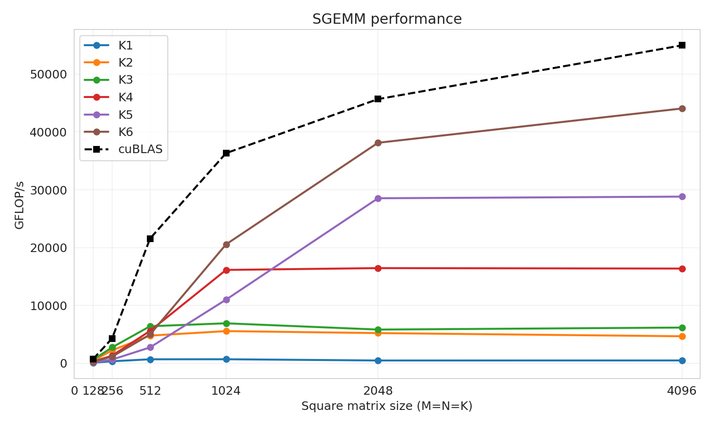

# 📈 Matrix Multiplication Optimization through Custom CUDA Kernels


A step-by-step implementation and optimization of FP32 matrix multiplication using CUDA, with cuBLAS as the performance baseline.


## 📗 1. Introduction
This project implements FP32 matrix multiplication using CUDA and optimzie them at kernel-level with bottleneck analysis and performance comparison. cuBLAS is chosen at the baseline for benchmarking.

## 📁 2. Dependencies
- CUDA 
    - CUDA Driver
    - CUDA toolkit 12
    - nvcc
    - cuBLAS
- Python >=3.10
- CMake 3.22
- Matplotlib, Seaborn, Pandas
## 🎯 3. Quick Start

### 1. Clone the project
```bash
git clone [repository]
cd cuda-matmul

# create virtual environment
python -m venv venv
source venv/bin/activate
```

### 2. Check your denpendencies
```bash
nvidia-smi                      # CUDA Driver
nvcc --version                  # CUDA C++ compiler
ldconfig -p | grep libcublas    # cuBLAS library
python3 --version               # python
cmake --version                 # CMake
```

### 3. Build
Run below command to build by `CMake` (NOTE: replace `set(CMAKE_CUDA_ARCHITECTURES 89)` with your compute capability):
```bash
bash scripts/build.sh 
```

### 4. Run
- Inspect the correctness of kernel implementation:
```bash
bash scripts/run_correctness.sh
```

- Run a single kernel (`build/matmul_bench --help` for more configuration):
```bash
build/matmul_bench --kernel <kernel_name> (e.g k1, k2...)>
```

- Run all kernel:
```bash
bash scripts/run_benchmark.sh
```

- Profiling kernel (change the ncu path (e.g `usr/local/cuda-12/bin/ncu`)):
```bash
bash scripts/ncu_profile.sh
```
## 🔬 4. Benchmark Methodology
All kernels benchmarked with cuBLAS baseline about:
- Latency:  time to complete kernel computation.
- GFLOPs/s (the giga floatting-point operations per second).

Read the `REPORT.md` to view detail analysis,  bottleneck identification and optimization.
## 📊 5. Result

## 🏗️ 6. Project Structure
```
CV-HK252/
├── LICENSE
├── README.md
├── REPORT.md                           # Performance analysis
├── CMakeLists.txt                      # CMake build configuration
├── requirements.txt
├── .gitignore
├── docs/                               
│   └── hardware.md                     # Benchmark environment
├── include/                            
│   ├── benchmark.cuh                   # Benchmark interface
│   ├── common.cuh                      # Device info getter
│   ├── cuda_check.cuh                  # CUDA & cuBLAS API check
│   ├── kernels.cuh                     # kernel launcher and kernel prototype
│   └── reference.cuh                   # cuBLAS run
├── results/    
│   ├── 128/                            # square matrix shape
|   |   ├── figures/                    # result chart
│   │   ├── profiles/                   # NVIDIA Nsight Compute profile
│   │   └── tables/                     # benchmark result in .csv
│   ├── 256/
|   |   ...
│   ├── 512/
|   |   ...
│   ├── 1024/
|   |   ...
│   ├── 2048/
|   |   ...
│   └── 4096/
|       ...
└── src/
	├── kernels/                        # kernel implementation
    |   ├── k1_naive.cu
    |   ├── k2_coalesced.cu
    |   ├── k3_smem_tiled.cu
    |   ├── k4_1d_thread_tiled.cu
    |   ├── k5_2d_register_tiled.cu
    |   ├── k6_vectorized.cu
    |   └── kernel_dispatch.cu
    ├── benchmark.cu             
    ├── correctness.cu
    ├── cublas_reference.cu
    └── main.cu                         # main script
```
## 💫 7. Future Work
- Implement futher optimization like autotuning, warptiling, ...
- Expand to more matrix shape.
## 📃 8. References
- [Fast CUDA SGEMM from Scratch
](https://github.com/siboehm/SGEMM_CUDA)
- [CUDA Course](https://github.com/infatoshi/cuda-course)
## ☎️ 9. Contact
Feel free to contact me via [vovanthinhv225@gmail.com](mailto:vovanthinhv225@gmail.com) for more information.